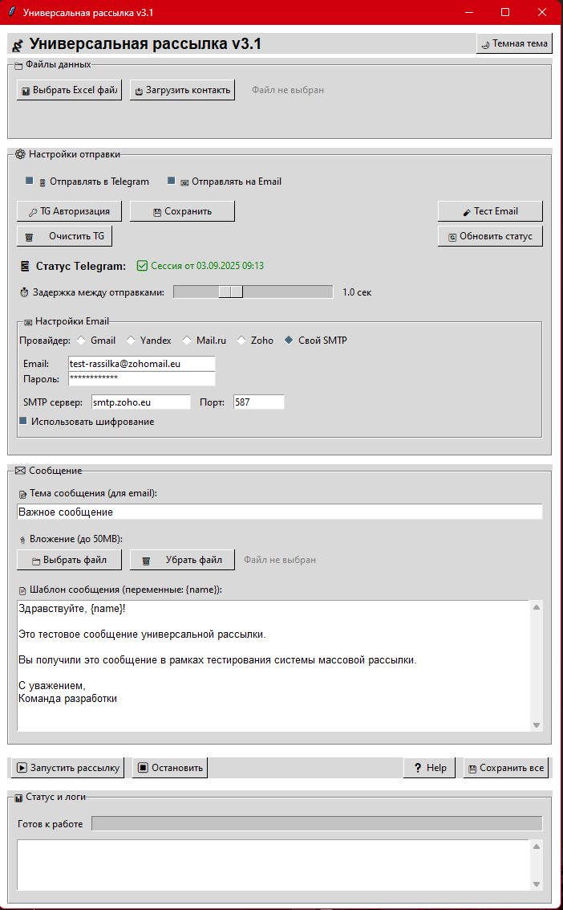
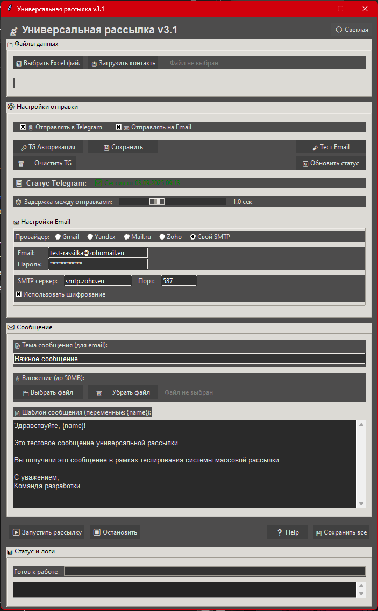

# 📡 Universal Sender v3.1

> Универсальная программа для массовых рассылок в Telegram и Email с современным графическим интерфейсом

[](https://www.python.org/)
[](LICENSE)
[]()

## ✨ Возможности

- 📱 **Telegram рассылка** - отправка через Pyrogram API
- 📧 **Email рассылка** - поддержка всех популярных провайдеров
- 📊 **Умный парсинг Excel** - автоматическое определение колонок
- 📎 **Файлы-вложения** - поддержка вложений до 50MB
- 🌙 **Темная/светлая тема** - современный интерфейс
- ⚙️ **Гибкие настройки** - задержки, методы отправки, шаблоны
- 📈 **Прогресс и логи** - детальная статистика отправки
- 🔒 **Безопасность** - локальное хранение настроек

## 🖼️ Скриншоты

### Светлая тема


### Темная тема  


## 🚀 Быстрый старт

### Требования
- Python 3.8+
- Windows/Linux/macOS

### Установка

```bash
# 1. Клонируйте репозиторий
git clone https://github.com/yourusername/universal-sender.git
cd universal-sender

# 2. Установите зависимости
pip install -r requirements.txt

# 3. Запустите программу
python universal_sender.py
```

### Создание Telegram сессии (только первый раз)
```bash
python make_pyrogram_session.py
```

## 📋 Подготовка данных

### Формат Excel файла
Программа автоматически найдет нужные колонки по ключевым словам:

| Поддерживаемые названия колонок |
|--------------------------------|
| **Telegram**: `Username`, `TG Name`, `Telegram`, `Nick` |
| **Email**: `Email`, `Mail`, `E-mail`, `Почта` |
| **Имя**: `Name`, `FIO`, `ФИО`, `Имя` |

### Пример структуры данных
```
| Name          | Username    | Email              |
|---------------|-------------|--------------------|
| Иван Петров   | @ivan_p     | ivan@example.com   |
| Мария Сидорова| @maria_s    | maria@gmail.com    |
```

## 🔑 Настройка Telegram

### 1. Получение API ключей
1. Перейдите на [my.telegram.org](https://my.telegram.org)
2. Войдите в аккаунт Telegram
3. Перейдите в **API development tools**
4. Создайте новое приложение
5. Скопируйте **API ID** и **API Hash**

### 2. Авторизация в программе
1. Запустите программу
2. Нажмите **"🔒 TG Авторизация"**
3. Введите API ID и API Hash
4. Введите номер телефона
5. Введите код из Telegram
6. При необходимости введите пароль 2FA

## 📧 Настройка Email

### Поддерживаемые провайдеры
- **Gmail** - `smtp.gmail.com:587`
- **Yandex** - `smtp.yandex.ru:587` 
- **Mail.ru** - `smtp.mail.ru:587`
- **Zoho** - `smtp.zoho.eu:587`
- **Свой SMTP** - ручная настройка

### Настройка Gmail
1. Включите двухфакторную аутентификацию
2. Создайте **пароль приложения**:
   - Google Account → Безопасность → Пароли приложений
   - Выберите приложение "Почта"
   - Скопируйте сгенерированный пароль
3. Используйте этот пароль в программе

### Тестирование
Нажмите **"🧪 Тест Email"** для проверки подключения

## 🎮 Использование программы

### Пошаговая инструкция
1. **Загрузите данные**
   - Нажмите "📊 Выбрать Excel файл"
   - Нажмите "📥 Загрузить контакты"

2. **Настройте отправку**
   - Выберите методы: Telegram ☑️ Email ☑️
   - Установите задержку между отправками
   - При необходимости выберите файл-вложение

3. **Создайте сообщение**
   - Введите тему (для email)
   - Напишите текст с переменной `{name}`
   - Пример: "Привет, {name}! Это тестовое сообщение."

4. **Запустите рассылку**
   - Нажмите "▶ Запустить рассылку"
   - Следите за прогрессом в логах
   - При необходимости остановите кнопкой "⏹ Остановить"

## 🔧 Продвинутые функции

### Переменные в шаблонах
- `{name}` - автоматически заменяется на имя получателя
- Пример: `"Здравствуйте, {name}! Персональное предложение для вас."`

### Управление задержками
- **0-1 сек**: Быстрая отправка (риск блокировок)
- **1-2 сек**: Рекомендуемая скорость
- **2+ сек**: Максимальная безопасность

### Файлы-вложения
- Поддержка любых типов файлов
- Максимальный размер: 50MB
- Автоматическая отправка в Telegram как документ

## ⚡ Производительность

| Параметр | Значение |
|----------|----------|
| Скорость отправки | ~30-60 сообщений/минуту |
| Максимум получателей | Неограничено |
| Размер вложений | До 50MB |
| Потребление RAM | ~100-200MB |

## 🛠️ Разработка

### Структура проекта
```
universal-sender/
├── universal_sender.py    # Основной код
├── make_pyrogram_session.py  # Создание Telegram сессии
├── requirements.txt       # Зависимости
├── config.json           # Настройки (создается автоматически)
├── *.session            # Telegram сессии
└── *.log               # Файлы логов
```

### Запуск в режиме разработки
```bash
python universal_sender.py
```

## 🐛 Решение проблем

### Telegram
- **"Username не существует"** - проверьте правильность username
- **"Приватность"** - пользователь запретил сообщения от незнакомых
- **"Flood wait"** - уменьшите скорость отправки

### Email
- **Ошибка аутентификации** - проверьте логин/пароль
- **SSL ошибки** - попробуйте другой порт (587/465)
- **Блокировка Gmail** - используйте пароль приложения

### Excel файлы
- **Не найдены колонки** - убедитесь в правильности названий
- **Ошибка чтения** - проверьте формат файла (.xlsx/.xls)

## 🤝 Вклад в проект

1. Fork репозитория
2. Создайте ветку для изменений
3. Внесите изменения
4. Создайте Pull Request

## 📄 Лицензия
Этот проект распространяется по Dual License (Free + Commercial).  
См. файл [LICENSE](LICENSE) для подробностей.

## 💼 Коммерческое использование

Для бизнеса доступны:
- 🤝 Гибкие условия сотрудничества
- 💰 Revenue sharing 5-20%
- 🛠️ Техническая поддержка  
- ⚡ Приоритетные обновления
- 🎨 Кастомизация интерфейса

**Контакт**: fxranxklin@proton.me

## 💰 Поддержать разработчика

Если программа оказалась полезной:

- **🟢 USDT (TRC20)**: `TSE6qB5efLq3bVuTrnU3FRvtEYQ9ktjUj4`
- **🟠 Bitcoin (BTC)**: `1HS2bhG8VfMYaswFR3ww1yuXc9kb3hPteJ`

---

<p align="center">
  <strong>📞 По вопросам: fxranxklin@proton.me</strong>
</p>
<p align="center">
  Made with ❤️ for the community
</p>
